% Low Code<br> No Code
% 
% Krzysztof Baciejowski, Adam Bednarz, Damian Baliński

##
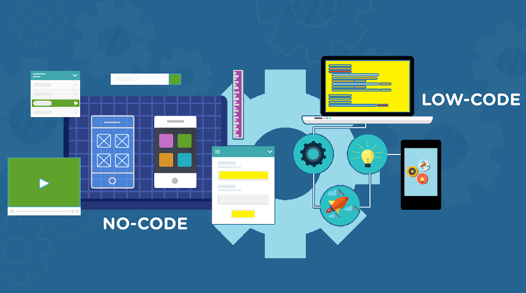{.stretch}\

##
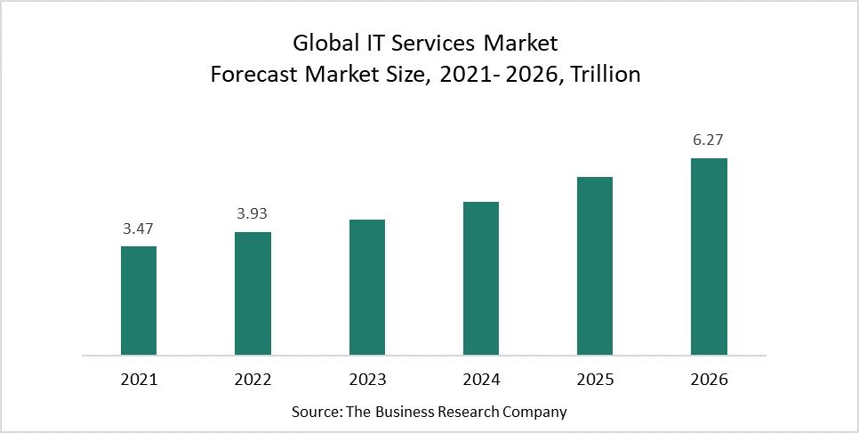{.stretch}\

##
<iframe width=100% height=600px src="https://www.youtube.com/embed/sEHsnVIx31E" title="YouTube video player" frameborder="0" allow="accelerometer; autoplay; clipboard-write; encrypted-media; gyroscope; picture-in-picture" allowfullscreen></iframe>

# Agenda
##
1. Czym jest low/no-code
2. Przeznaczenie aplikacji typu low/no-code
3. Kiedy low/no-code to zły pomysł?
4. Zalety technologii low/no-code
5. Wady technologii low/no-code
6. Narzędzia do tworzenia aplikacji low-code i no-code

##
7. Tworzenie aplikacji low-code
8. Tworzenie aplikacji no-code
9. Porównanie low-code do podejścia tradycyjnego
10. Zgadywanka
11. Podsumowanie 
12. Bibliografia

# Czym jest<br> low/no-code

##
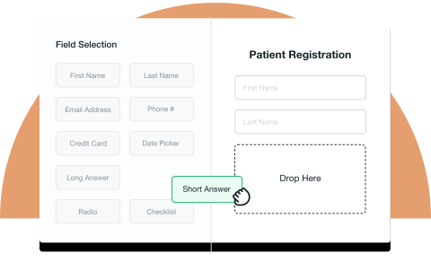{.stretch}\

## Przeznaczenie aplikacji typu low/no-code
- MVP (Minimum Viable Product)
- Proste aplikacje bazodanowe 
- Na wewnętrzny użytek spółki

##
<button style="position: absolute; top: 0; right: 0; color:white; background-color: transparent; background-repeat: no-repeat; border: none; outline: none;" onclick="document.getElementById('ex1').src='https://www.appsheet.com/start/c53b2021-8e48-42f1-a287-29e68e3d837a'">&#8635;</button>
<iframe id="ex1" width=100% height=600px src="https://www.appsheet.com/start/c53b2021-8e48-42f1-a287-29e68e3d837a">
</iframe>

##
<button style="position: absolute; top: 0; right: 0; color:white; background-color: transparent; background-repeat: no-repeat; border: none; outline: none;" onclick="document.getElementById('ex2').src='https://www.appsheet.com/start/1c2a2d2c-ec8a-4e03-9fc4-b73a8d82a6b8'">&#8635;</button>
<iframe id="ex2" width=100% height=600px src="https://www.appsheet.com/start/1c2a2d2c-ec8a-4e03-9fc4-b73a8d82a6b8">
</iframe>

## Kiedy low/no-code to zły pomysł?
- gdy potrzeba podniesionego poziomu bezpieczeństwa
- gdy aplikacja musi przetwarzać dane
- gdy nie lubimy płacić ;)

# Zalety

##
### Odciążenie wykwalifikowanych programistów

##
### Redukcja czasu i kosztów wytwarzania oprogramowania

##
### Pole działania w obrębie jednej platformy na rózne systemy

##
### Odporność na zachodzące zmiany

##
### Możliwość rozszerzania o bardziej zaawansowane funkcje

##
### Skrócenie drogi od klienta do wykonawcy

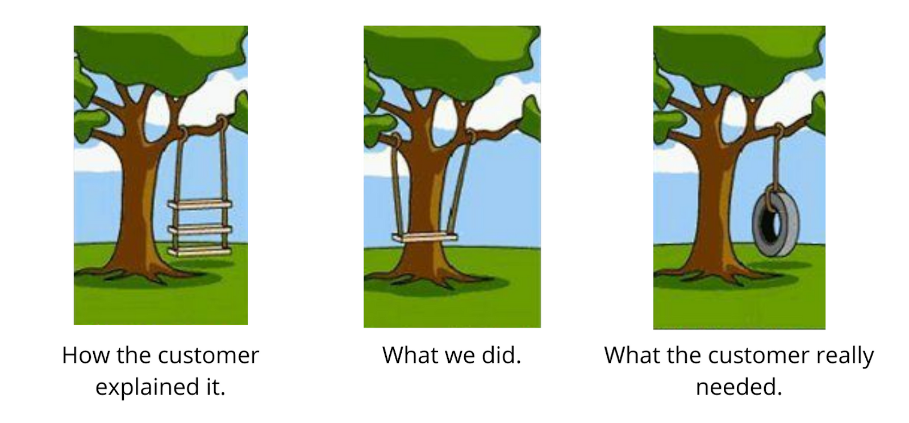\

## 
### Trzy najczęściej wymieniane zalety

#. Niski próg wejścia
#. Zmniejszenie kosztów implementacji
#. Bogate i funkcjonalne komponenty

<span style="font-size: xx-small; "> Source: Characteristics and Challenges of Low-Code Development Perspective (2021) - Yajing Luo, Peng Liang, Chong Wang, Mojtaba Shahin, Jing Zhan</span>

# Wady

##
### Węższe pole działania w trakcie budowania aplikacji

##
### Potrzeba dostosywowania projektu do możliwości platformy

##
### Brak pełnej swobody nad zarządzaniem aplikacją

##
### Vendor Lock-In (Uzależnienie od dostawcy)

##
### Spadki wydajności działania i wzrost kosztów utrzymania

##
### Ograniczona kompatybilność z innymi środowiskami

##
### Trzy najczęściej wymieniane wady

#. Wysokie ceny usług
#. Ograniczona personalizacja
#. Spadek wydajności

<span style="font-size: xx-small; "> Source: Characteristics and Challenges of Low-Code Development Perspective (2021) - Yajing Luo, Peng Liang, Chong Wang, Mojtaba Shahin, Jing Zhan</span>

# Narzędzia

## Zoho Creator
(Low Code)

Deluge - skryptowy język do tworzenia workflowów

##
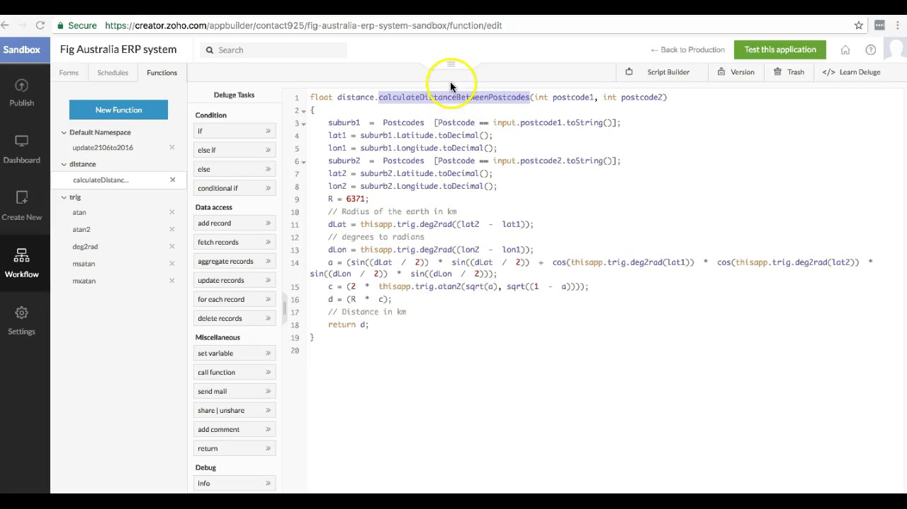\

##
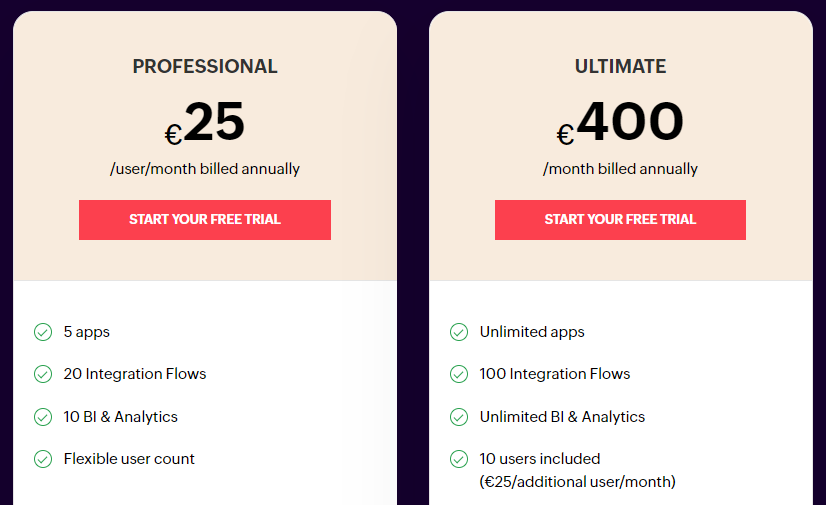\

## Mendix
(Low Code)

Workflow Visual Language

##
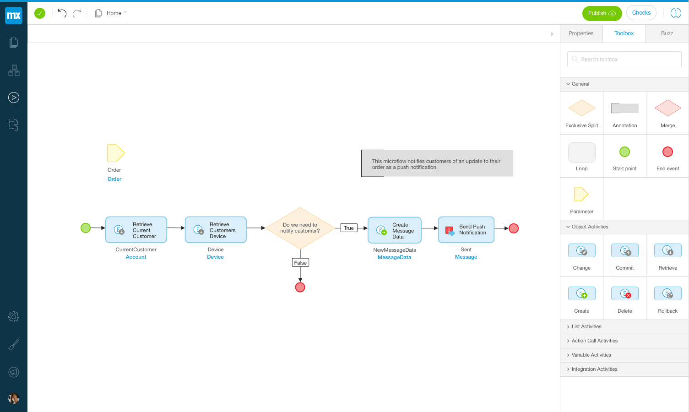\

##
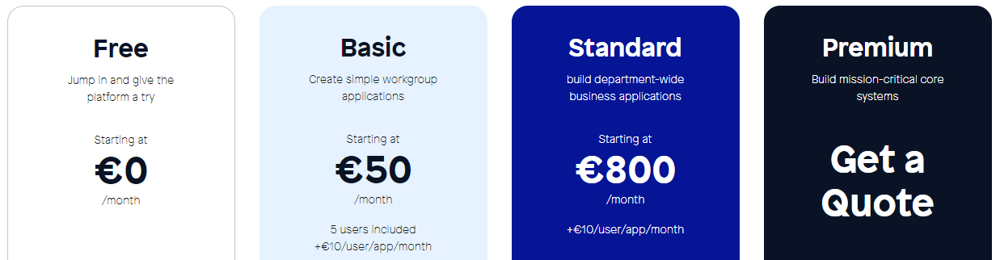\

## Microsoft PowerApps
(Low Code)

#. Pełna kompatybilność z usługami Microsoft
#. Microsoft Power Fx language

##
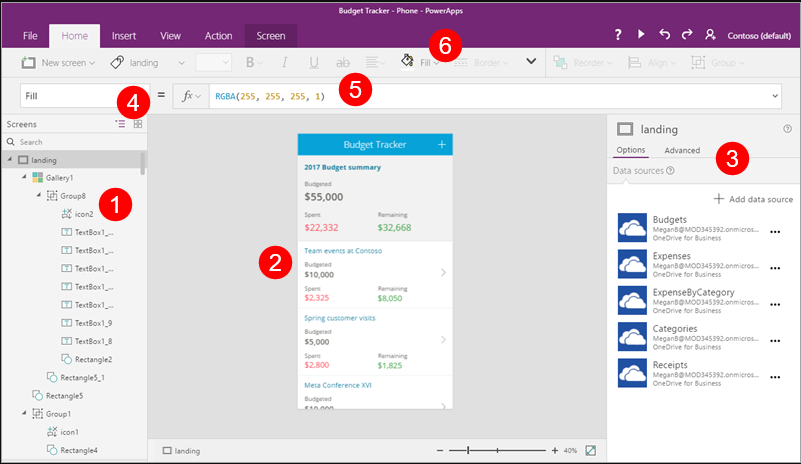\

##
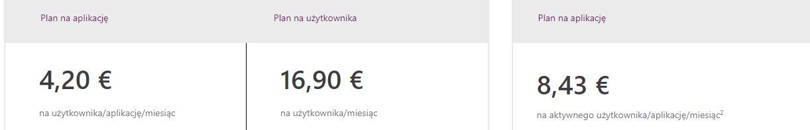\


## Amazon Honeycode
(No Code)

#. Wbudowana baza danych oparta na arkuszach kalkulacyjnych
#. Moduł Automations (triggery)

##
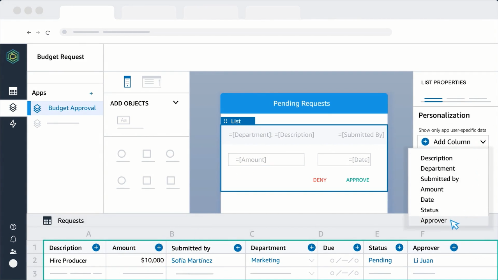\

##
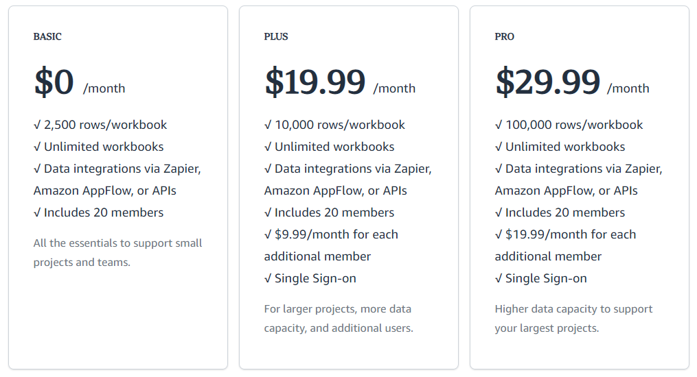\

## Google AppSheet
(No Code)

#. Powiązanie z Google Workspace
#. Brak drag and drop UI

##
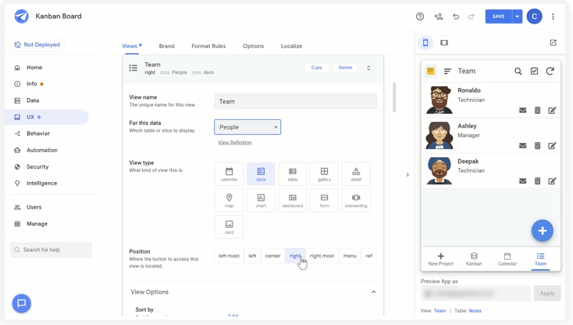\

##
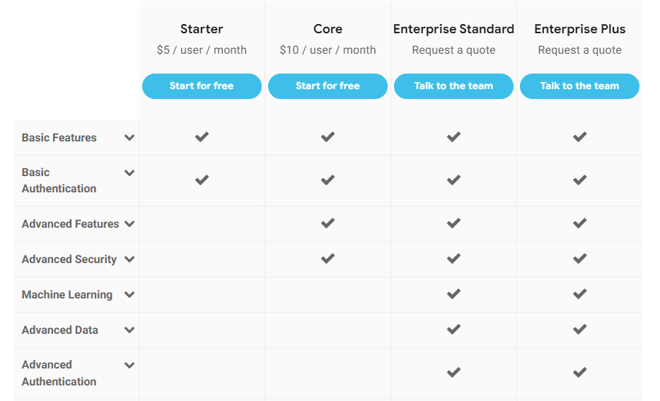\

## Bubble.io
(No Code)

#. Baza danych AWS
#. Łączenie się z innymi serwisami

##
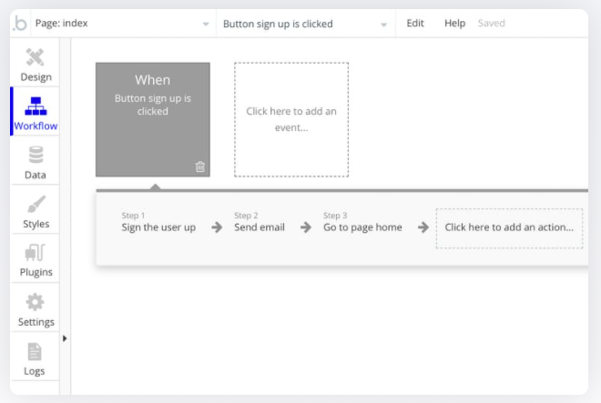\

##
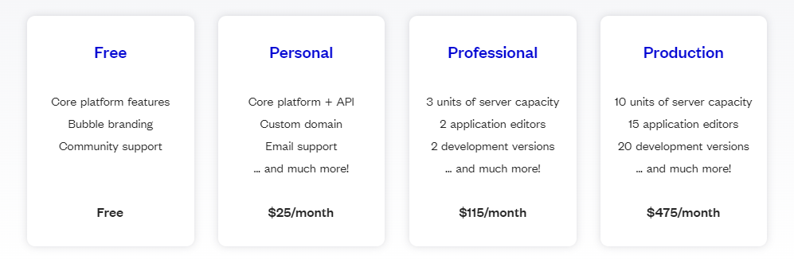\

# Power Apps

## Tworzenie aplikacji<br> low-code
<video width=100% height=100% autoplay controls><source src="video/tworzenie.mp4" type="video/mp4"></video>

## Przykładowa aplikacja<br> low-code
<video width=100% height=100% autoplay controls><source src="video/gotowa.mp4" type="video/mp4"></video>


# AppSheet

## Tworzenie aplikacji no-code
<video width=100% height=100% autoplay controls><source src="video/AppSheet.mp4" type="video/mp4"></video>

## Przykładowa aplikacja<br>no-code
<button style="position: absolute; top: 0; right: 0; color:white; background-color: transparent; background-repeat: no-repeat; border: none; outline: none;" onclick="document.getElementById('noCode').src='https://www.appsheet.com/start/8284be45-d1c8-4b97-abd0-7f2b3d471d3e'">&#8635;</button>
<iframe id="noCode" width=100% height=500px src="https://www.appsheet.com/start/8284be45-d1c8-4b97-abd0-7f2b3d471d3e"></iframe>

# Porównanie

##
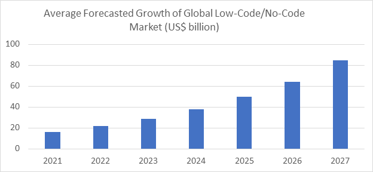\

<span style="font-size: xx-small; "> Source: www.spreadsheetweb.com/how-big-is-the-global-low-code-no-code-market-and-how-fast-is-it-growing</span> 

##
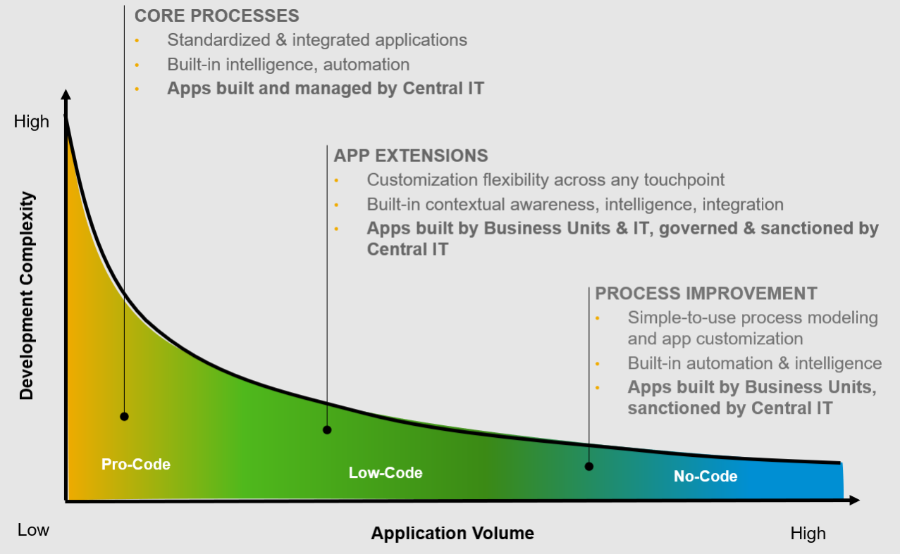\

<span style="font-size: xx-small; "> Source: www.blogs.sap.com/2020/09/11/unveiling-sap-intelligent-rpa-2.0-hyperautomation-for-everyone/</span>

##
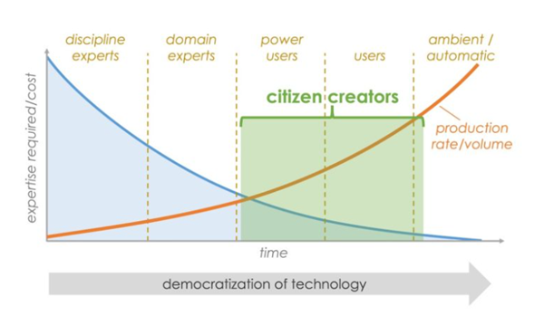\

<span style="font-size: xx-small; "> Source: www.martechalliance.com/stories/the-rising-of-no-code-or-low-code-as-martech-solutions-for-digital-marketers</span>

# Zgadywanka
##
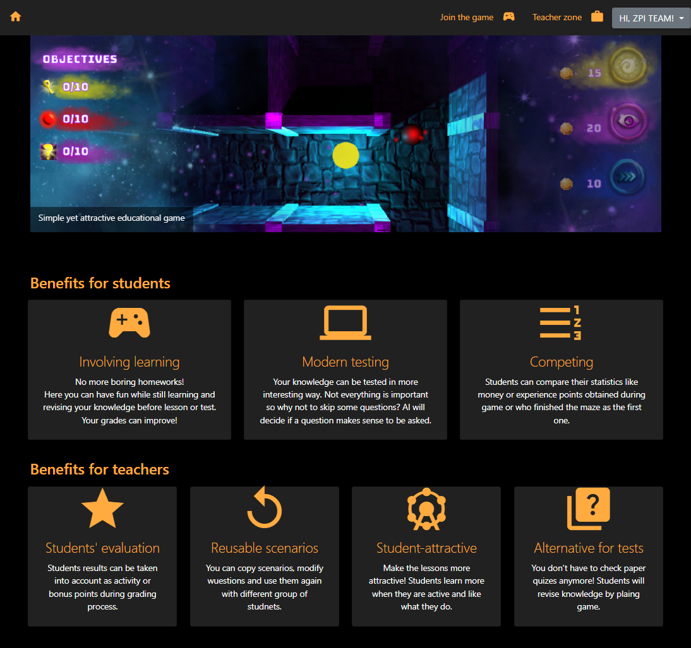

<script>
    let images = ['images/Topics_create.png', 'images/Questions_View.png', 'images/main_page.png'];
    let index = 0;
    const imgElement = document.querySelector('#mainPhoto');
    
    function change() {
        imgElement.src = images[index];
        index === images.length-1 ? index = 0 : index++;
    }
    
    window.onload = function () {
        setInterval(change, 3000);
    };
</script>

##
<button style="position: absolute; top: 0; right: 0; color:white; background-color: transparent; background-repeat: no-repeat; border: none; outline: none;" onclick="document.getElementById('page').src='https://saltbranding.com/'">&#8635;</button>
<iframe id="page" width=100% height=600px src="https://saltbranding.com/">
</iframe>

##
<div style="position: absolute; top: 32px; left: 70px; background-color: black; width: 210px; height: 20px"/>
<iframe width=100% height=600px src="https://www.youtube.com/embed/a-Qc57S_CzY?start=3" title="YouTube video player" frameborder="0" allow="accelerometer; autoplay; clipboard-write; encrypted-media; gyroscope; picture-in-picture" allowfullscreen></iframe>

##
<button style="position: absolute; top: 0; right: 0; color:white; background-color: transparent; background-repeat: no-repeat; border: none; outline: none;" onclick="document.getElementById('game').src='https://js13kgames.com/games/spacecraft/index.html'">&#8635;</button>
<iframe id="game" width=100% height=600px src="https://js13kgames.com/games/spacecraft/index.html"></iframe>

##
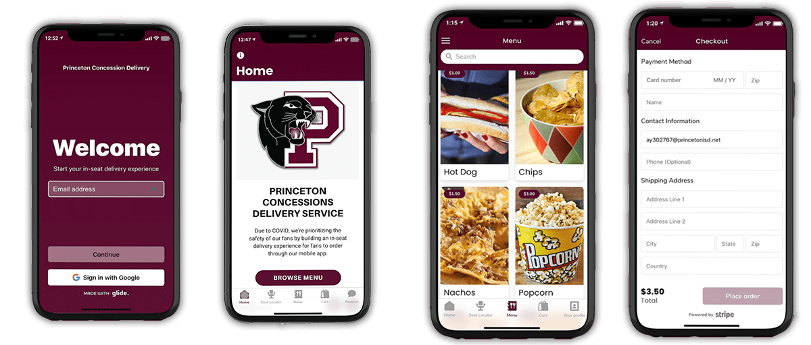{.stretch}\

##
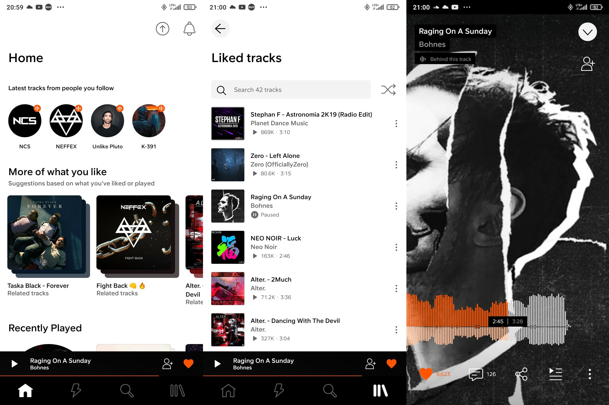{.stretch}\

# Podsumowanie

##
### Szybksza implementacja w zamian za mniejszą elastyczność

##
### Dodatkowy koszt systemu w zamian za czas programistów

##
### Otwarcie świata IT na ludzi z biznesu

## Języki programowania<br> low-code
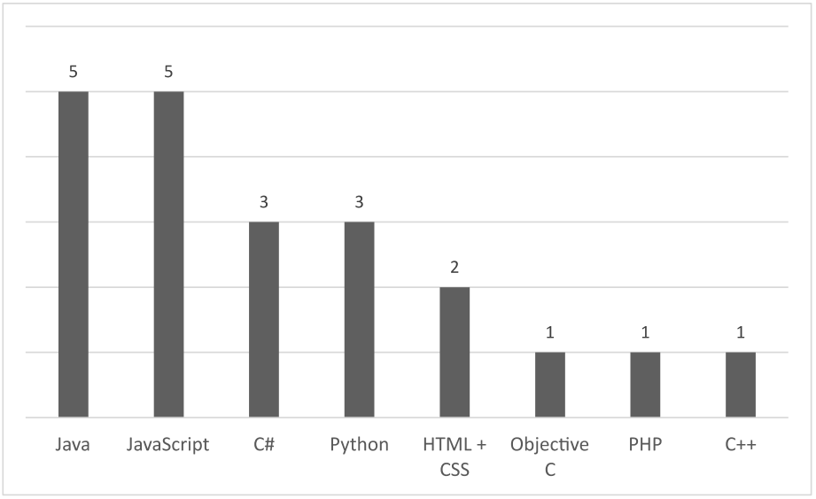{.stretch}\

<span style="font-size: xx-small; position: absolute; bottom: 0; left: 130px; ">Yajing Luo, Peng Liang, Chong Wang, Mojtaba Shahin, Jing Zhan (2021). Characteristics and Challenges of Low-Code Development: The
Practitioners - arXiv repository</span>

# Bibliografia
##
```
Richardson, C., et al., "New development platforms emerge for customer-facing applications." Forrester: Cambridge, MA, USA, vol. 15 (2014).
```

```
Sanchis, R., et al., "Low-code as enabler of digital transformation in manufacturing industry." Applied Sciences vol. 10 (2020).
```

```
Beranic, T., Rek, P., and Heričko, M., "Adoption and usability of low-code/no-code development tools." Central European Conference on Information and Intelligent Systems. 2020.
```

```
Luo, Y., et al., "Characteristics and Challenges of Low-Code Development: The Practitioners' Perspective." Proceedings of the 15th ACM/IEEE International Symposium on Empirical Software Engineering and Measurement (ESEM). 2021.
```

```
Kubera, G., "Low-code/No-code - przyszłość tworzenia aplikacji" 20.09.2021 URL: https://www.computerworld.pl/news/Low-code-no-code-przyszlosc-tworzenia-aplikacji,424154.html [dostęp: 2022-03-05]
```

```
Johannessen, C. and Davenport, T., "When Low-Code/No-Code Development Works and When It Doesn’t" 22.06.2021 URL: https://hbr.org/2021/06/when-low-code-no-code-development-works-and-when-it-doesnt [dostęp: 2022-03-05]
```