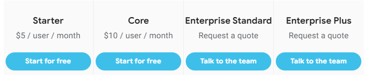

% Low Code<br> No Code
% 
% Krzysztof Baciejowski, Adam Bednarz, Damian Baliński

##
{.stretch}\

##
<iframe width=100% height=600px src="https://www.youtube.com/embed/sEHsnVIx31E" title="YouTube video player" frameborder="0" allow="accelerometer; autoplay; clipboard-write; encrypted-media; gyroscope; picture-in-picture" allowfullscreen></iframe>

##
{.stretch}\

## Przeznaczenie aplikacji typu low/no-code
- MVP (Minimum Viable Product)
- Proste aplikacje bazodanowe 
- Na wewnętrzny użytek spółki

##
<button style="position: absolute; top: 0; right: 0; color:white; background-color: transparent; background-repeat: no-repeat; border: none; outline: none;" onclick="document.getElementById('ex1').src='https://www.appsheet.com/start/c53b2021-8e48-42f1-a287-29e68e3d837a'">&#8635;</button>
<iframe id="ex1" width=100% height=600px src="https://www.appsheet.com/start/c53b2021-8e48-42f1-a287-29e68e3d837a">
</iframe>

##
<button style="position: absolute; top: 0; right: 0; color:white; background-color: transparent; background-repeat: no-repeat; border: none; outline: none;" onclick="document.getElementById('ex2').src='https://www.appsheet.com/start/1c2a2d2c-ec8a-4e03-9fc4-b73a8d82a6b8'">&#8635;</button>
<iframe id="ex2" width=100% height=600px src="https://www.appsheet.com/start/1c2a2d2c-ec8a-4e03-9fc4-b73a8d82a6b8">
</iframe>

## Kiedy low/no-code to zły pomysł?
- gdy potrzeba podnisionego poziomu bezpieczeństwa
- gdy aplikacja musi przetwarzać dane
- gdy nie lubimy płacić ;)

# Power Apps

## Tworzenie aplikacji<br> low-code
<video width=100% height=100% autoplay controls><source src="video/tworzenie.mp4" type="video/mp4"></video>

## Przykładowa aplikacja<br> low-code
<video width=100% height=100% autoplay controls><source src="video/gotowa.mp4" type="video/mp4"></video>


# AppSheet

## Tworzenie aplikacji no-code
<video width=100% height=100% autoplay controls><source src="video/AppSheet.mp4" type="video/mp4"></video>

## Przykładowa aplikacja<br>no-code
<button style="position: absolute; top: 0; right: 0; color:white; background-color: transparent; background-repeat: no-repeat; border: none; outline: none;" onclick="document.getElementById('noCode').src='https://www.appsheet.com/start/8284be45-d1c8-4b97-abd0-7f2b3d471d3e'">&#8635;</button>
<iframe id="noCode" width=100% height=500px src="https://www.appsheet.com/start/8284be45-d1c8-4b97-abd0-7f2b3d471d3e"></iframe>


# Dla Adama
## Cennik Microsoft Power Apps
{.stretch}\

## Cennik Google AppSheet
{.stretch}\


# Zgadywanka
##


<script>
    let images = ['images/Topics_create.png', 'images/Questions_View.png', 'images/main_page.png'];
    let index = 0;
    const imgElement = document.querySelector('#mainPhoto');
    
    function change() {
        imgElement.src = images[index];
        index === images.length-1 ? index = 0 : index++;
    }
    
    window.onload = function () {
        setInterval(change, 3000);
    };
</script>

##
<button style="position: absolute; top: 0; right: 0; color:white; background-color: transparent; background-repeat: no-repeat; border: none; outline: none;" onclick="document.getElementById('page').src='https://saltbranding.com/'">&#8635;</button>
<iframe id="page" width=100% height=600px src="https://saltbranding.com/">
</iframe>

##
<iframe width=100% height=600px src="https://www.youtube.com/embed/a-Qc57S_CzY?start=3" title="YouTube video player" frameborder="0" allow="accelerometer; autoplay; clipboard-write; encrypted-media; gyroscope; picture-in-picture" allowfullscreen></iframe>

##
<button style="position: absolute; top: 0; right: 0; color:white; background-color: transparent; background-repeat: no-repeat; border: none; outline: none;" onclick="document.getElementById('game').src='https://js13kgames.com/games/spacecraft/index.html'">&#8635;</button>
<iframe id="game" width=100% height=600px src="https://js13kgames.com/games/spacecraft/index.html"></iframe>

##
{.stretch}\

##
{.stretch}\

# Bibliografia
##
```
New development platforms emerge for customer-facing applications. Forrester (2014) - Clay Richardson, John R Rymer, Christopher Mines, Alex Cullen, Dominique Whittaker
```

```
Characteristics and Challenges of Low-Code Development: The Practitioners’ Perspective (2021) - Yajing Luo, Peng Liang, Chong Wang, Mojtaba Shahin, Jing Zhan
```

```
Low-code/No-code - przyszłość tworzenia aplikacji - Grzegorz Kubera
[dostęp: 2022-03-05]
```

```
When Low-Code/No-Code Development Works and When It Doesn’t - Chris Johannessen, Tom Davenport
[dostęp: 2022-03-05]
```
